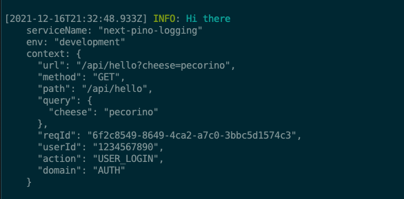
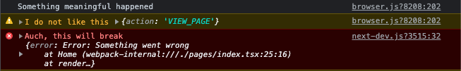

## [NextJS](https://nextjs.org/) logging using [Pino](https://github.com/pinojs/pino)

> Structured logging with request-id + custom context data

This repo demonstrates one solution to structured logging in NextJS (compatible with NodeJS middlewares)

### API logging

- `userId` is extracted from `req.user` or JWT token in `Authorization` header.
- `reqId` is forwarded from `X-Request-Id` or generated if not present
- `url`, `method`, `path`, `query` is extracted from requests
- `serviceName` and `env` set in [logger/index.tx](https://github.com/tomfa/nextjs-pino-logging/blob/master/logger/index.tsx)
- Additional fields (`action`/`domain`) set by caller



_Example: [pages/api/hello.tsx](https://github.com/tomfa/nextjs-pino-logging/blob/master/pages/api/hello.tsx)_ – the output above is formatted with [`pino-pretty`](https://github.com/pinojs/pino-pretty).

```ts
const handler = baseHandler().get((req, res) => {
  const user = { id: "123", name: "John Doe " };
  Logger.info("Hi there", {
    action: "USER_LOGIN",
    domain: "AUTH",
  });

  res.status(200).json(user);
});
```


### Browser logging

When logger is imported in browser, output will be displayed in console. 



_Example: [pages/index.tsx](https://github.com/tomfa/nextjs-pino-logging/blob/master/pages/index.tsx)_

```ts
Logger.info('Something meaningful happened')
Logger.warning('I do not like this', { action: 'VIEW_PAGE'})
Logger.error('Auch, this will break', { error: new Error('Something went wrong')})
```

### Local setup

```bash
yarn
yarn dev
```

- Visit [http://localhost:3000/api/hello?query=value](http://localhost:3000/api/hello?query=value) to see API logging
- Visit [http://localhost:3000/api/error](http://localhost:3000/api/error) to see API error handling and logging
- Visit [http://localhost:3000/](http://localhost:3000/) to see browser logging in console
 
